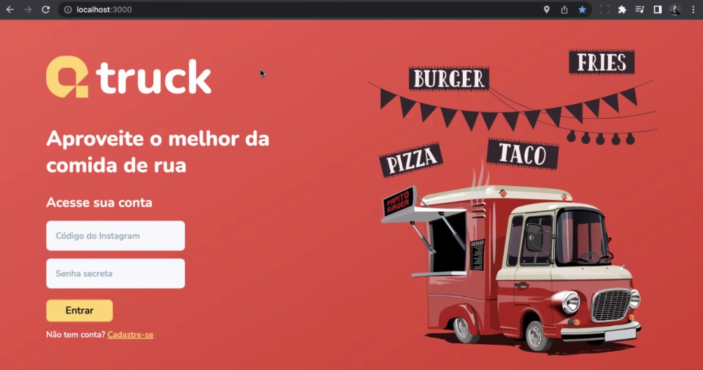
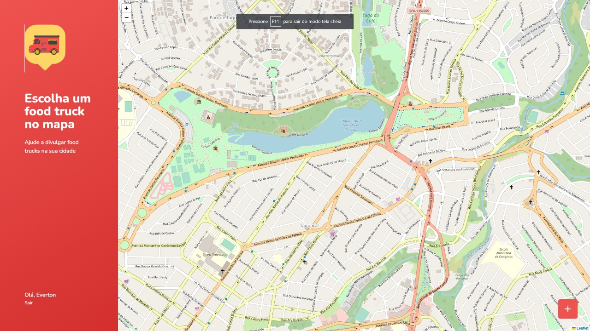

# 
# 
<br><br><br><br>

## Projeto de automação de QAcademy Bootcamp<br> [Avançado em Cypress]
Usando a Aplicação Qtruck desenvolvida para o curso. </br>
Utilizando a estratégia de PageObject (PO).</br>
Link Código da Aplicação: https://github.com/evrasouza/qtruck-application

<br>
⚡ LOGIN <br>
<br><br>

⚡ DASHBOARD <br>
<br><br>

### Componentes necessários para executar o projeto

- Nodejs (Versão *16.16*)
- yarn
- cypress (verão *10.4.0*)

## Tecnologias, pacotes e ferramentas utilizados 

:heavy_check_mark: <b> [VSCode](https://code.visualstudio.com/download) </b><br>
:heavy_check_mark: <b> [Git](https://gitforwindows.org/) </b><br>
:heavy_check_mark: <b> [Hyper](https://hyper.is/plugins) </b><br>
:heavy_check_mark: <b> [Node.js](https://nodejs.org/en/) </b><br>
:heavy_check_mark: <b> [Yarn](https://yarnpkg.com/) </b><br>
:heavy_check_mark: <b> [cypress](https://www.cypress.io/) </b><br>

### Informações para execução do Projeto<br>
*Para clonar e executar a aplicação acessar o link*
```
https://github.com/evrasouza/qtruck-application
```

*Clonar o projeto de teste automatizado*
```
$ git clone https://github.com/evrasouza/qacademybootcamp-cypress-qtruck
```

### Informações baixar as dependencias do projeto de testes e executa-lo

*_1º Passo - Baixar as dependencias de Test_* <br/>
     Em um terminal baixar as dependencias de Teste <br/>
     Na pasta Test no terminal, informe o comando <br/>
     ```
    $ yarn install -D
    ```    <br/>
*_2º Passo - Abrir o Cypress_* <br/>
  Na pasta de Tests no terminal, informe o comando <br/>
     ```
    $ npx cypress open
    ```  <br/>
*_3º Passo - Após start o cypress aparecerá a tela de Boas vindas do Cypress_* <br/>
  Deve escolher a opção do E2E Testing conforme imagem abaixo: <br/>
  <br><br>
*_4º Passo - Irá carregar a tela para escolher qual navegador irá executar a automção_* <br/>
  Será apresentado as navegadores instalados em sua máquina<br>
  No exemplo abaixo, Executar *_Start E2E Testing in Chrome_*  <br/>
  <br><br>
*_5º Passo - irá carregar a inicialização da automação_* <br/>
  Escolher qual arquivo deve ser inicializado <br/>
  <br><br>

*Em manutenção*

*Autor:* Everton Souza <br/>
*Curso:* QAcademy Bootcamp [Avançado em Cypress]
